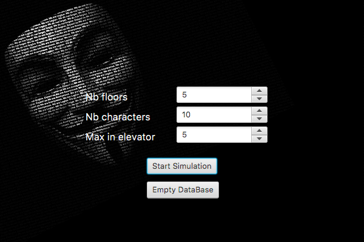
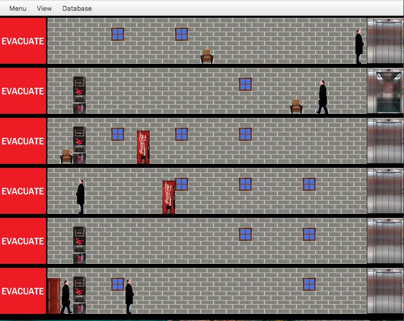
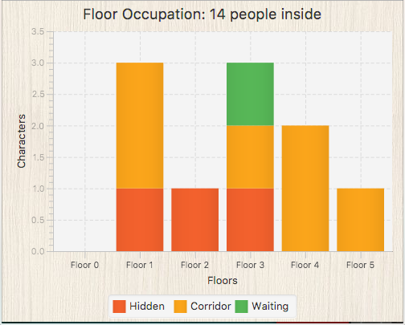

# Rapport final du projet Mikolivator
Ce projet a été réalisé dans le cadre du cours de laboratoire Java, présent dans l'unité d'enseignement ATLIR5 à la HE2B-ESI.

## Auteurs
- Olivier Cordier (42442)
- Mike Sarton (41864)

## Maitre-assistant
- Anne Rousseau

## Description détaillée du projet
Mikolivator est un simulateur d'ascenseur dans un bâtiment à plusieurs étages. Il permet de produire un comportement aléatoire de personnes se déplaçant dans un bâtiment et ayant un objectif aléatoire (un étage à atteindre). Ces personnes se déplacent jusqu'à leur objectif en utilisant l'ascenseur. Une fois l'objectif atteint, ils y restent un temps aléatoire avant d'avoir un nouvel objectif.

Ils reproduiront ce comportement indéfiniment.

Les données qui seront entrées en paramètres sont les suivants:
1.  Le nombre de personnes générées au cours de la simulation. Ce nombre doit sera compris entre 1 et 100 inclus. Une fois ce nombre atteint, plus aucune personne ne sera générée dans le bâtiment.

2.  Le nombre de personnes maximum qui pourront entrer dans un ascenseur simultanément. Ce nombre peut être compris entre 1 et 10 inclus.

3.  Le nombre d'étages dans le bâtiment. Ce nombre est compris entre 1 et 7 inclus (Le rez-de-chaussée n'étant pas inclus).

Ces différents paramètres seront définis par l'utilisateur avant le début de la simulation et ne seront pas changés durant toute la durée de celle-ci.

Sur la fenêtre d'option permettant de choisir les paramètres de simulation, il est également possible d'effectuer un reset de la base de donnée du programme (moyennant une confirmation lors de la suppression). L'état de cette requête sera affiché permettant à l'utilisateur de savoir si la suppression a été bien effectuée ou non.

A chaque étage du bâtiment se trouve un bouton rouge "évacuation". A n'importe quel moment de la simulation, l'utilisateur peut cliquer sur celui-ci pour demander l'évacuation de l'étage concerné. Lorsque l'étage est évacué, chaque personnes s'y trouvent se dirigera vers l'ascenseur afin de se diriger vers le rez-de-chaussée.

Lorsqu'un étage est évacué, l'ascenseur pourra toujours atteindre cet étage afin de permettre aux personnages de descendre au rez-de-chaussée. Durant cette évacuation, plus personne ne pourra avoir cette étage comme destination.

Une fois le bouton d'évacuation cliqué, celui-ci donnera place à un autre bouton vert nommé "ouverture" qui devra être cliqué pour qu'à nouveau un personnage puisse générer comme destination l'étage en question.

Dans l'interface graphique, il sera possible via le menu "View" d'afficher 2 vues supplémentaires du simulateur.

La première vue correspondant en un tableau dont les lignes correspondent aux étages et les colonnes aux différents emplacements à chaque étage. A savoir:

1. Position cachée derrière la porte (personnage non visible)
2. Dans le couloir (en déplacement)
3. Devant l'ascenseur à attendre celui-ci
4. Dans l'ascenseur

Ce tableau comprend dans les cases correspondantes le nombre de personnes s'y trouvant et rien sinon.

La deuxième vue est un diagramme en bâton dynamique: sur l'abscisse sont représentés les différents étages et sur l'ordonnée sont représentés le nombre de personnes présents à cet étage. Chaque bâton peut être subdivisé en bâton de couleurs différentes permettant de visualiser facilement la position des personnages dans l'étage.

Ce diagramme permet également de savoir à tout moment combien de personnes ont actuellement été générées dans le building.

## Instructions
Le projet tel que remit (push sur GitLab) n'a aucune dépendance vers une quelconque librairie externe. Cependant, une partie du projet nécessitant la persistance des données dans une base de donnée, il faudra mettre en place celle-ci pour pouvoir utiliser le simulateur avec toutes ses fonctionnalités.

Néanmoins, si la base de donnée n'est pas mise en place, le simulateur fonctionnera correctement mais ne permettra pas la sauvegarde de l'historique des simulations et donc l'affichage de cet historique.

### Mise en place de la base de donnée
Une fois le projet ouvert dans Netbeans:

1.  Se rendre dans l'onglet "Services/Base de donnée/JavaDB"
2.  Clique droit sur "JavaDB" > Propriétés
3.  Dans la partie "Installation de JavaDB", parcourir et indiquer le chemin vers le dossier "JavaDB" présent dans le dossier "lib" du projet.
4.  Dans la partie "Emplacement de la BD", parcourir et indiquer le chemin vers le dossier "database" présent à la racine du projet.
5.  Une fois la base de donnée "MikolivatorDB" apparue, faire clique droit > "Connect"
6.  UserID : `mikoli`, password: `ilokim`
7.  Une fois la base de donnée connectée, prendre le schéma `Mikoli` par défaut. Pour ce faire, dérouler tous les schémas générés automatiquement par défaut, clique droit sur Mikoli > "Selectionner comme schéma par défaut".

Une fois que la base de donnée a été mise en place, la simulation permettra dès lors de sauvegarder l'historique des simulations. Les informations concernant ces historiques seront accessibles dans l'application via le menu "Database".

## Illustrations

